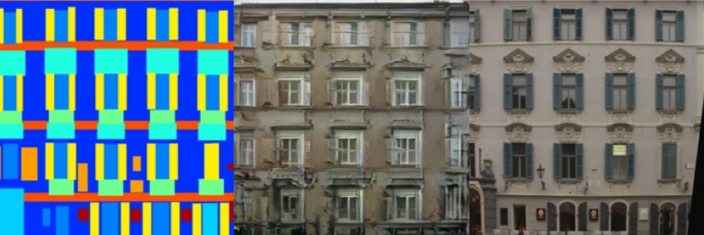
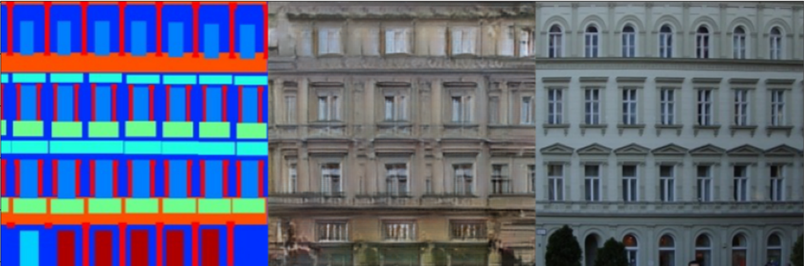
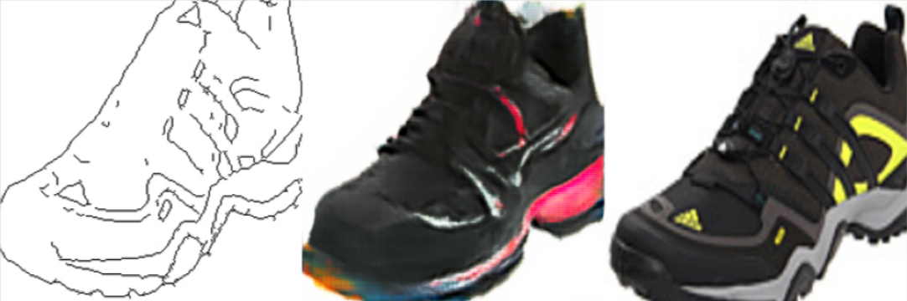
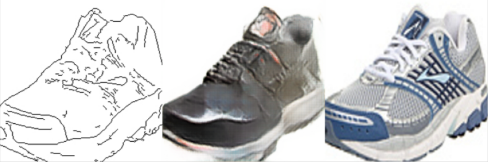

# pix2pix

A simple implementation of pix2pix specified for an image translation task. A referencing project is [pytorch-CycleGAN-and-pix2pix](https://github.com/junyanz/pytorch-CycleGAN-and-pix2pix).
<br> <br>
It was trained on [`facades`](http://cmp.felk.cvut.cz/~tylecr1/facade/) and [`edges2shoes`](http://vision.cs.utexas.edu/projects/finegrained/utzap50k) datasets.

# Train

To train a model from scratch put a dataset into a home folder. Then run:
```
python main.py --from_checkpoint=False --training=True --testing=False
```

# Evaluation

Firstly, we need to download pretrained versions of a model.

## Checkpoints

To download a checkpoint choose a dataset: `DATASET=facades`, `DATASET=edges` or `DATASET=both`. Then run the following commands:
```
cd scripts
bash download_checkpoints.sh
```

## Evaluation

To evaluate a model run:
```
python main.py --training=False --testing=True
```

# Examples

Here are several examples obtained for these checkpoints:
- Left image: source modality;
- Middle image: predicted modality;
- Right image: target modality;

### Facades




### Edges2Shoes



